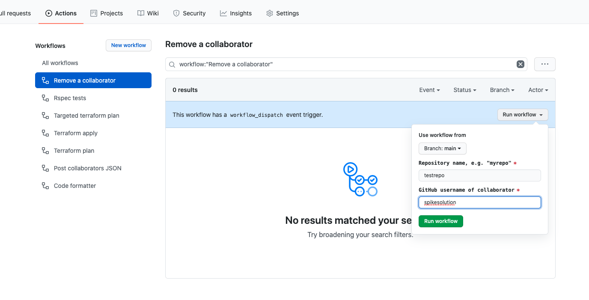

# GitHub External Collaborators

Manage MoJ GitHub external collaborators via code.

## Requesting collaborator access

If you want to allow access to an MoJ GitHub repository for an external collaborator, please raise a pull request making the required changes to the corresponding `terraform/[repository-name].tf` file in this repository.

If you are not confident editing terraform code, you can [raise an issue](https://github.com/ministryofjustice/github-collaborators/issues/new?labels=Access+Request&template=access-request.md) to request access for a collaborator, and we will make the changes for you.

## Background

Sometimes we need to grant access to one of more of our github repositories to people who are not part of the "ministryofjustice" github organisation. This often happens when we engage third-party suppliers to carry out work on our behalf.

Github has the concept of "external collaborators" for this purpose. We can grant a certain level of access to a specific repository to an individual github user account.

Rather than manage this via "clickops" this repository enables us to manage these relationships via terraform code. This also means we can attach metadata to the collaborator relationship, to explain its purpose. This will help to ensure that collaborators are removed when they no longer need access to the relevant github repositories.

## How it works

* The `terraform/` directory contains a file per repository that has collaborators, defining the collaboration with metadata. The name of the file is the repository name with any `.` characters replaced with `-` to render the name acceptable for terraform. i.e. the file for repository `foo.bar` will be `terraform/foo-bar.tf`

* Github actions run `terraform plan` and `terraform apply` to keep the collaborations in GitHub in sync with the terraform source code
* Ruby code in the `bin/` and `lib/` directories (with unit tests in the `spec/` directory) queries GitHub via the GraphQL API and retrieves all the collaborator relationships which exist
* A github action runs periodically and compares the collaborators in GitHub with the terraform source code. Any collaborators which are not fully specified in the terraform source code are included in a JSON report which is the basis for [this report].
* A utility script will import existing external collaborators from specified github repositories, create the corresponding terraform code, and import into terraform state

## Removing collaborators

* If the collaborator is defined in terraform code

Raise and merge a PR removing the collaborator from the list of collaborators in the terraform source code file for the repository.

* If the collaborator is not defined in terraform code

This will be the case if access was granted by a repository administrator via the github UI.

> You should not need to do this manually - there is a github action which runs daily, and removes all collaborators who are not defined in terraform code.

To remove such a collaborator, use [this GitHub Action](https://github.com/ministryofjustice/github-collaborators/actions?query=workflow%3A%22Remove+a+collaborator%22)



1. Click the `Run workflow` button
2. Enter the repository name and the username of the collaborator to remove
3. Click `Run workflow`

## Defining collaborators

To define collaborators on a repository, first add a terraform file corresponding to the repository (unless there already is one).

The filename should be `<repository-name>.tf` where `repository-name` is the repository name **with any `.` characters replaced by `-`**

The file should contain:

```
module "<repository-name>" {
  source     = "./modules/repository-collaborators"
  repository = "<repository.name>"
  collaborators = [
  ]
}
```

> The value of `repository` inside the file should be the exact name of the repository, with no substitutions. i.e. if the repository is called `ministryofjustice/foo.bar` then put `repository = "foo.bar"`

To add collaborators to the repository, define each of them inside the `collaborators` block, with the following information inside the quotation marks:

```
    {
      github_user  = "<github username>"
      permission   = "push"  #  pull|push|maintain|triage|admin
      name         = ""  #  The name of the person behind github_user
      email        = ""  #  Their email address
      org          = ""  #  The organisation/entity they belong to
      reason       = ""  #  Why is this person being granted access?
      added_by     = ""  #  Who made the decision to grant them access? e.g. 'Awesome Team <awesome.team@digital.justice.gov.uk>'
      review_after = ""  #  Date after which this grant should be reviewed/revoked, e.g. 2021-11-26
    },
```

For example:

```
  collaborators = [
    {
      github_user  = "digitalronin"
      permission   = "admin"
      name         = "David Salgado"
      email        = "david@acme.com"
      org          = "Acme. Corp."
      reason       = "Acme are building some stuff for us"
      added_by     = "Awesome Team <awesome.team@digital.justice.gov.uk>"
      review_after = "2021-11-26"
    },
  ]
```

You can add comments (prefixed with `#` on every line) to these files to provide additional context/information.

### Import existing collaborators

If you have a repository which already has collaborators, there is a utility script which will create the required terraform file and import the existing collaborators into the terraform state:

```
bin/import-repository-collaborators.rb
```

See the usage details below.

> This has already been done for all repository collaborators which existed as at 2020-11-24

If you have manually added an external collaborator to a repository which is already defined in this repository, you should edit the terraform file as usual, but you will also need to import the existing collaborator into the terraform state like this:

```
terraform import module.<repository name>.github_repository_collaborator.collaborator[\"github username\"]> <repository name>:<github username>
```

e.g.

```
terraform import module.testing-external-collaborators.github_repository_collaborator.collaborator[\"toonsend\"] testing-external-collaborators:toonsend
```

## Pre-requisites

* [Terraform] 0.13+

### Environment Variables

* `ADMIN_GITHUB_TOKEN` must contain a GitHub personal access token (PAC) enabled for MoJ SSO, with the following scopes:
  * admin:org
  * repo
  * read:user
  * user:email

* `OPERATIONS_ENGINEERING_REPORTS_API_KEY` must contain the API key required to POST data to the [Operations Engineering Reports] web application.
* `OPS_ENG_REPORTS_URL` must contain the URL of the [Operations Engineering Reports] web application endpoint to which the generated JSON data should be POSTed.

* `TERRAFORM` must define the terraform executable (e.g. `/usr/local/bin/terraform0.13.5`)

* `AWS_ACCESS_KEY_ID` & `AWS_SECRET_ACCESS_KEY` - credentials with access to the S3 bucket holding the terraform state file

See [env.example](./env.example) for more more information.

## Usage

### `bin/external-collaborators.rb`

This script is run on a schedule by a [github action](.github/workflows/post-data.yaml) You can also run it manually either by [triggering the action], or running locally like this:

```
bin/external-collaborators.rb
```

This outputs a JSON document suitable for POSTing to the [Operations Engineering Reports] web application.

You can also use the `bin/post-data.sh` script to generate and POST the JSON data manually.

#### Caveats

* Does not report any external collaborators who have not yet accepted their invitation to collaborate. Pending collaborators are not reported by the github graphql API.

### `bin/list-repositories.rb`

Output the names of all current (i.e. excluding deleted/archived/locked) MoJ github repositories.

### ` bin/import-repository-collaborators.rb`

This script takes a list of names of MoJ github repositories, and creates a file for each repository, in the `terraform` directory, defining all of that repository's external collaborators.

e.g. running

```
bin/import-repository-collaborators.rb acronyms`
```

...will create the file `terraform/acronyms.tf`

It also imports any existing collaborators into the terraform state.

### Import all repositories' collaborators

```
bin/list-repositories.rb | xargs bin/import-repository-collaborators.rb
```

> This takes quite a long time.

[Operations Engineering Reports]: https://github.com/ministryofjustice/operations-engineering-reports
[triggering the action]: https://github.com/ministryofjustice/github-collaborators/actions?query=workflow%3A.github%2Fworkflows%2Fpost-data.yaml
[Terraform]: https://www.terraform.io/downloads.html
[this report]: https://operations-engineering-reports.cloud-platform.service.justice.gov.uk/github_collaborators
